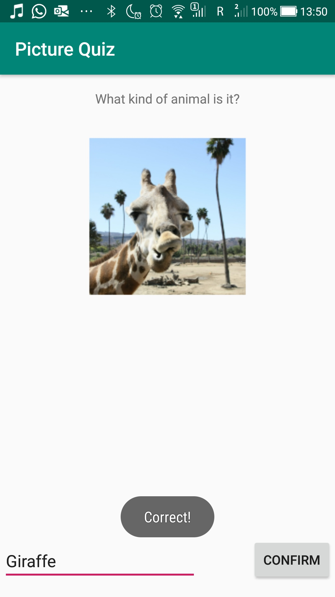

# Level 1 Example - Picture Quiz
This is the very first example app of this course. Its development was demonstrated during the first seminar on February, 3rd.
## What's inside
Basically, this is a simple quiz which presents a picture and asks the user what kind of animal is displayed. There is only one possible option though - a giraffe. The user can type his answer in an EditText field and verify his answer by clicking the button. Then a Toast message is displayed depending on what the user has typed.

<figure class="image">

<figcaption>A screenshot of the working app</figcaption>
</figure>
